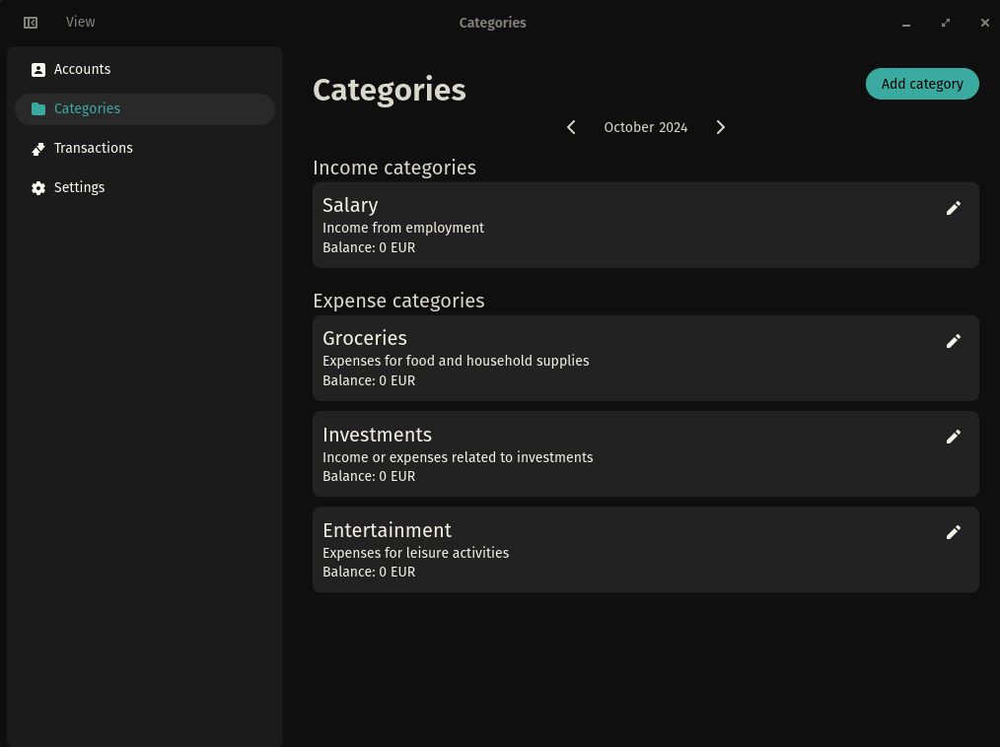
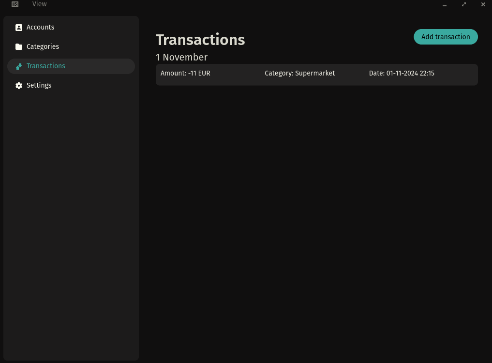

<p align="center">
  
</p>

# Cosmic Money

**Cosmic Money** is a simple and intuitive personal finance manager for the **Cosmic** desktop environment.
Designed to help you keep track of your finances, Cosmic Money allows you to manage accounts and transactions, view summaries, and monitor balances.

## Features

- **Account Management**: Create and manage multiple financial accounts.
- **Transaction Management**: Add, view, and edit transactions with support for custom categories.
- **Account Balance**: Automatically calculate each account’s balance based on transactions.
- **Minimalist Interface**: A clean and simple design, perfectly integrated with the Cosmic desktop environment.

## Installation

The project supports various installation methods:

**Flatpak**: You can install Cosmic Money as a Flatpak package for simpler distribution.

### Installing from Source

#### Steps

To install the application from source, follow these steps:

```bash
# Clone the repository
git clone https://github.com/francesco-gaglione/cosmic-money

# Enter the project directory
cd cosmic-money

# Build the Release version for better performance
just build-release

# Install
sudo just install
```

## Configuration

The **Cosmic Money** settings allow you to customize:

- Transaction categories.
- Multiple accounts and balance management.

All settings are accessible through the user interface.

## Screenshots

Here’s a preview of **Cosmic Money**:

### Dashboard



### Transactions



## Contributing

Contributions are welcome! A contribution guide will be available soon.

## Future Goals

1. Statistics
2. Data Import/Export
3. AI-Powered Analytics

## License

Distributed under the **MIT** license. See the [LICENSE](./LICENSE) file for more details.
